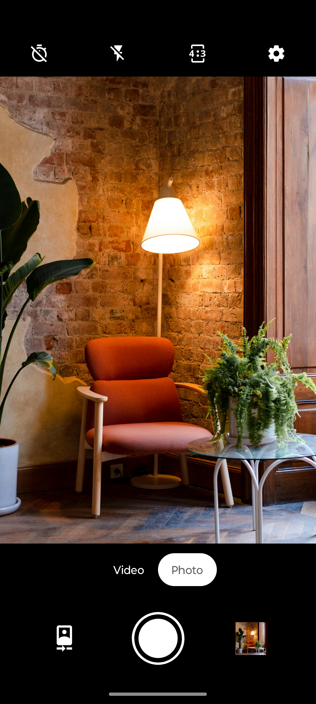
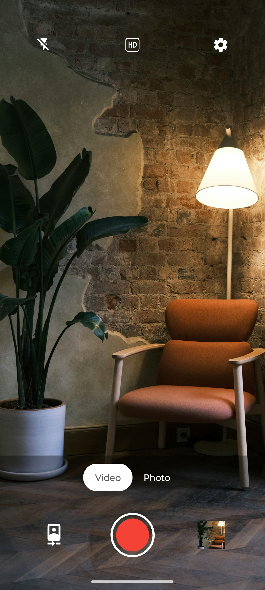
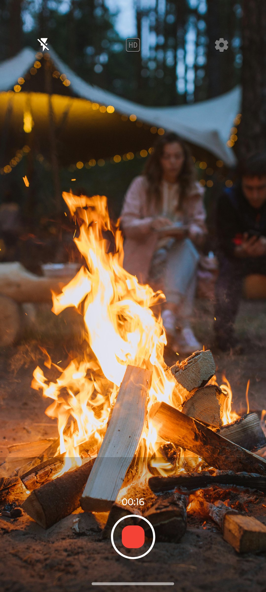

# Fossify Camera

 

Fossify Camera is your go-to app for capturing life’s moments with precision and privacy. Whether
you’re snapping photos or recording videos, this fully customizable, privacy-respecting camera app
is designed to meet your needs.

**📸 YOUR PRIVACY, OUR PRIORITY:**  
With the Fossify Camera app, your data remains private. Enjoy a camera that works without internet
access or intrusive permissions, ensuring your photos and videos stay secure.

**🚀 SEAMLESS PERFORMANCE:**  
Fossify Camera provides a fluid and responsive interface. Switch between photo and video modes,
adjust zoom, and toggle between front and rear cameras instantly. Capture moments with zero lag and
experience smooth performance at all times.

**🖼️ COMPLETE CUSTOMIZATION:**  
Personalize every aspect of your camera experience. Adjust the output quality, customize the save
path, and set the resolution to suit your needs. You can even customize colors and themes to match
your style.

**⚡ DYNAMIC CONTROLS:**  
Toggle settings with ease—control flash, aspect ratio, and zoom directly from the camera view. The
app is designed for quick access, letting you capture moments efficiently, with intuitive controls.

**🖼️ MATERIAL DESIGN:**  
Enjoy a sleek, user-friendly interface with material design and a dynamic theme that adapts to your
preferences. Whether you're using the app during the day or at night, Fossify Camera provides a
smooth and intuitive experience.

**🌐 OPEN-SOURCE ASSURANCE:**  
Fossify Camera is built on an open-source foundation. With our commitment to transparency, you can
review the code on GitHub and be part of a community that values privacy and trust.

Fossify Camera offers everything you need to capture moments effortlessly while respecting your
privacy.

➡️ Explore more Fossify apps: https://www.fossify.org 
➡️ Open-Source Code: https://www.github.com/FossifyOrg 
➡️ Join the community on Reddit: https://www.reddit.com/r/Fossify 
➡️ Connect on Telegram: https://t.me/Fossify

